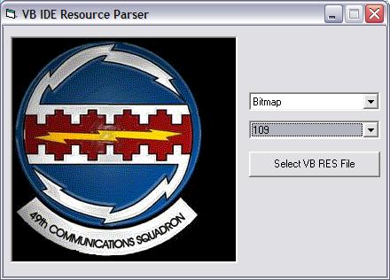



## FYI: Parse Uncompiled RES File

### Description

Hmmm, another one for usercontrol lovers maybe. I wanted a way for a UC to get the resources from a host's RES file during IDE. This way the UC can use host images and display them during design time. The biggest problem was parsing the res file, the 2nd biggest problem is being able to access it during IDE design, IDE Run, and Compiled all from a UC and not the host. For a UC during IDE, you would need to have a way for the user to supply you the path to their RES file and, in a few days, I will be posting an example of that along with other methods too. The functions in the attached class allow image resources to be extracted as stdPictures or arrays -- this way I can use my c32bppDIB class with it too :)
 
### More Info
 

             |
---                |---
**Submitted On**   |2007-01-02 22:17:52
**By**             |[LaVolpe](https://github.com/Planet-Source-Code/PSCIndex/blob/master/ByAuthor/lavolpe.md)
**Level**          |Intermediate
**User Rating**    |5.0 (45 globes from 9 users)
**Compatibility**  |VB 6\.0
**Category**       |[Files/ File Controls/ Input/ Output](https://github.com/Planet-Source-Code/PSCIndex/blob/master/ByCategory/files-file-controls-input-output__1-3.md)
**World**          |[Visual Basic](https://github.com/Planet-Source-Code/PSCIndex/blob/master/ByWorld/visual-basic.md)
**Archive File**   |[FYI\_\_Parse204055122007\.zip](https://github.com/Planet-Source-Code/lavolpe-fyi-parse-uncompiled-res-file__1-67542/archive/master.zip)

